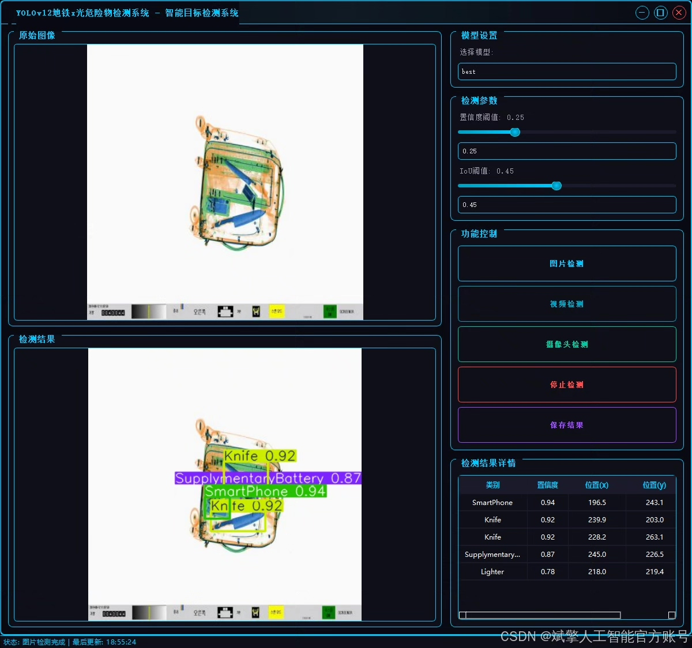
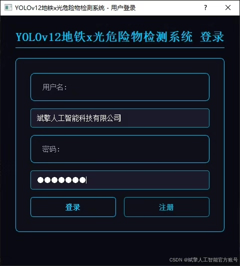
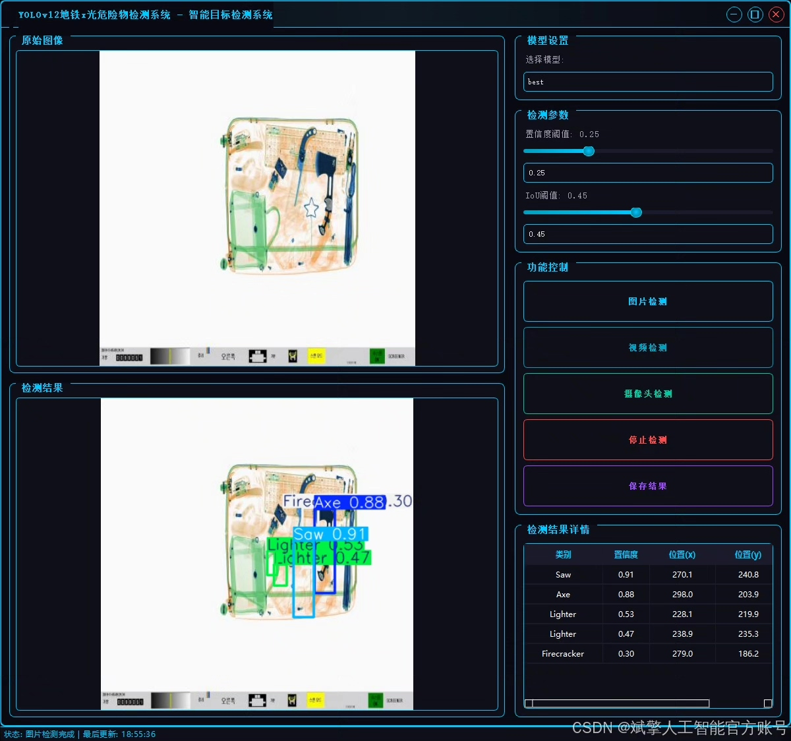
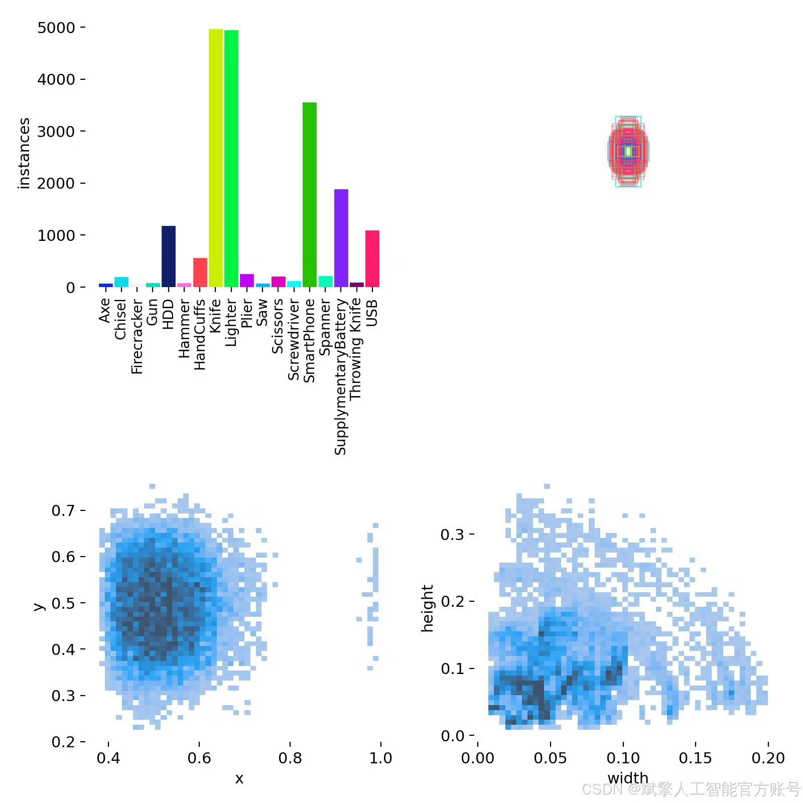
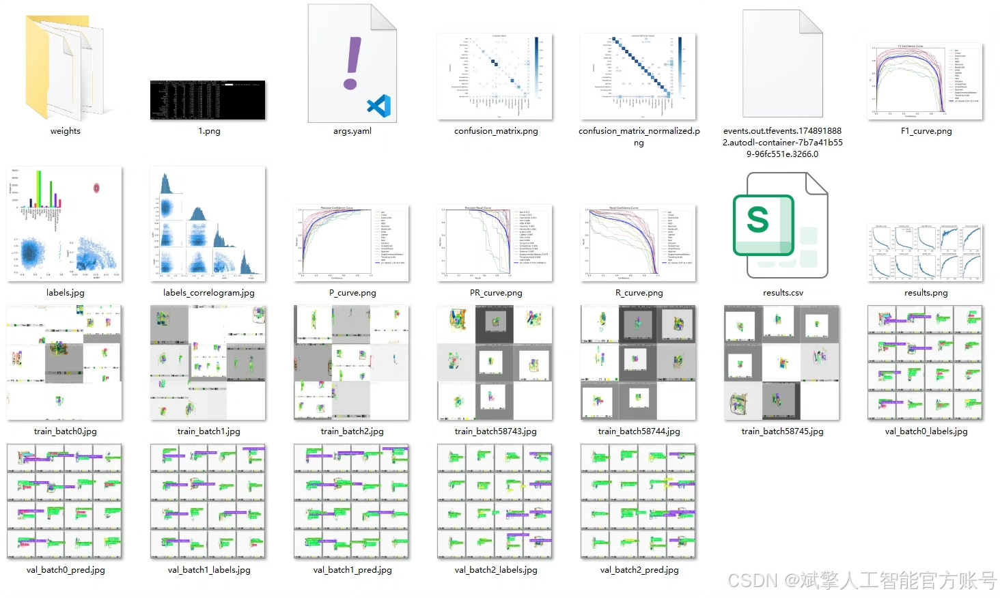
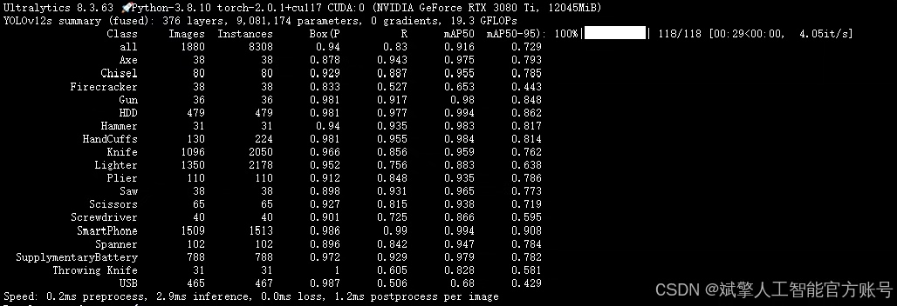
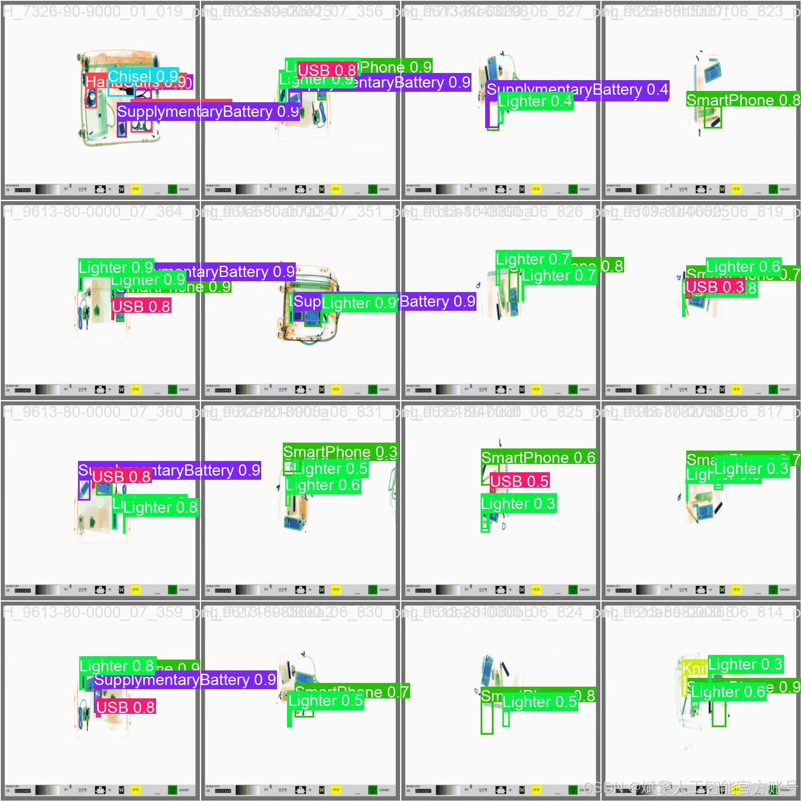
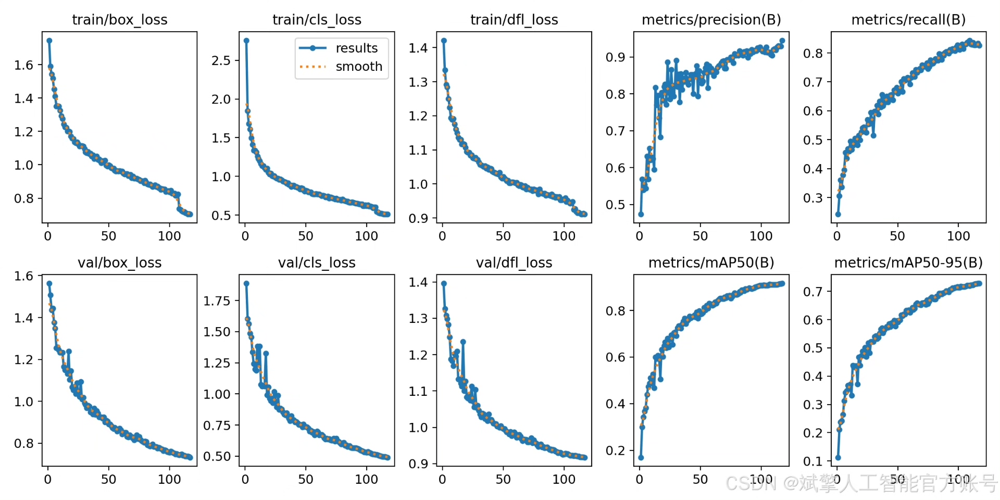
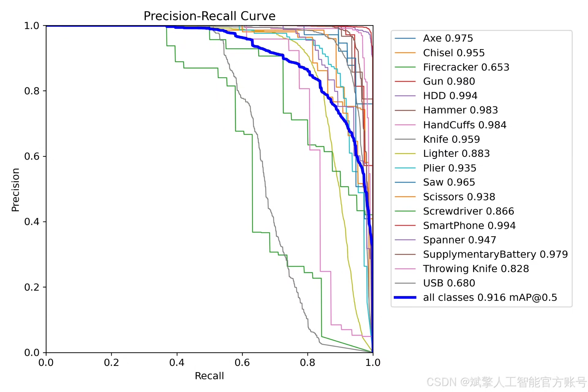

# YOLOv12 security inspection hazard detection system

## Body

YOLOv12 Security Inspection System for High-risk Object Identification Based on Deep Learning YOLOv12

The system is based on the YOLOv12 model, and it includes a YOLOv12+YOLO dataset, UI interface, login registration interface, Python project source code, and model.

The system has 18 categories: ['Axe', 'Chisel', 'Firecracker', 'Gun', 'HDD', 'Hammer', 'HandCuffs', 'Knife', 'Lighter', 'Plier', 'Saw', 'Scissors', 'Screwdriver', 'SmartPhone', 'Spanner', 'SupplymentaryBattery', 'Throwing Knife', 'USB'].
There are 4385 training images and 1880 validation images in the dataset.

✅ User Login and Registration: Support password detection and security verification.

✅ Three detection modes: Based on the YOLOv11 model, support image, video, and real-time camera three detections, accurately identify targets.

✅ Dual-screen comparison: Display the original image and the detection result on the same screen.

✅ Data visualization: Real-time table displaying the category, confidence, and coordinates of the detected target.

✅ Intelligent parameter adjustment: Provide a confidence slide bar to dynamically optimize the detection accuracy, adapt to different scene needs.

✅ Sci-fi style interactive interface: Dark theme combined with dynamic light effects, reducing visual fatigue and improving operational experience.

## Images

## Payment

Here is a pay link on Stripe ( https://buy.stripe.com/3cs8yP7sY87d0vu9AB ). Please contact me lonlonago@foxmail.com after funding $89, and I will send you a complete data files , thank you!

